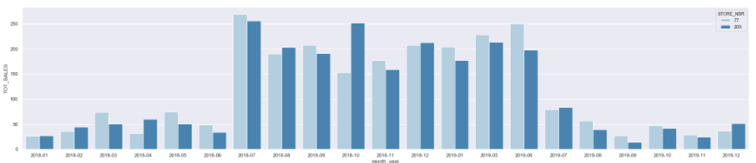
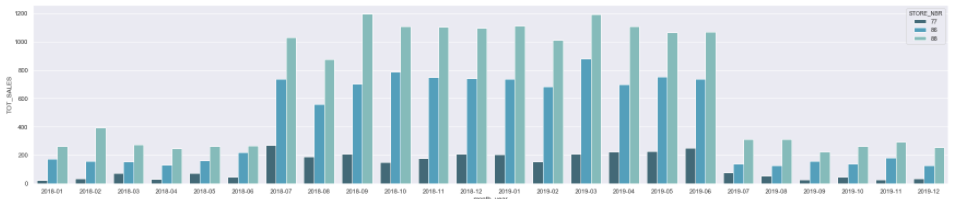
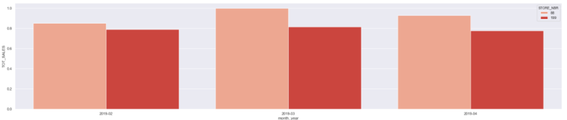

# Quantium Virtual Internship: Project Overview

- Undertook data cleaning, transformation and preparation of a large sample dataset from a major retailer

- Carried out customer analytics to derive insights into customer spending behaviour and high performing products

- Developed a strategy for the spending manager to implement, which would optimise slaes for specific product categories 

- Created a measure to compare different control stores against stores which had recently trialled new layouts

- Used the most suitable control store to benchark performance and used performance analytics to assess the impact of new layouts in trial stores

## Resources

**Python Version:** 3.7

**Packages:** pandas, numpy, matplotlib, seaborn

**Project Basis:** Virtual Internship with Quantium

## Data Preparation and Customer Analytics

 This consisted of the following stages:

- Examined transaction data looking for inconsistencies, missing data and outliers

- Cleaned the data using ordinal mapping and filling of missing values and outliers with statistical best fit values

- Merged customer data with transaction data to create a unified sales dataset

- Defined performance metrics and identified total sales, drivers of sales and highest performing products

- Conducted a deep dive into customer segments to advise which segments should be targeted.  

Some highlights are below.

**Total Sales by Brand**

**Product Weights with Outliers**

**Sales Profile (All Stores) - Full Observation Period**

This indicated that the brands with the highest sales were Doritos, Smiths and Kettle. This also revealed that sales were highest in December during the holiday season.

## Experimentation and Uplift Testing

I undertook experimentation and uplift testing to identify control stores, consisting of the following stages:

- Determined total sales revenue and total number of customers on monthly and annual bases and number of transactions per customer

- Normalised salaes values and created a metric to compare the sales performance different control stores to each of the trial stores

- Control stores were selected based on their similarity to trial stores

- The performance of trial stores was compared to the control stores to assess the impact of the new trial layout

Some highlights are below.

**Comparison of Trial and Control Store Pair**

**Trial Store Sales Perforance - Full Observation Period**

**Trial Store vs Control Store Sales During Trial Period**

 This revealed that the trial layout resulted in higher sales during the trial period.
 
 ## Analytics and Commercial Application
 
 In this stage, I synthesised the results from the previous stages to prepare a summary report to the client. The results informed strategy recommendations for the client. 
 
 

